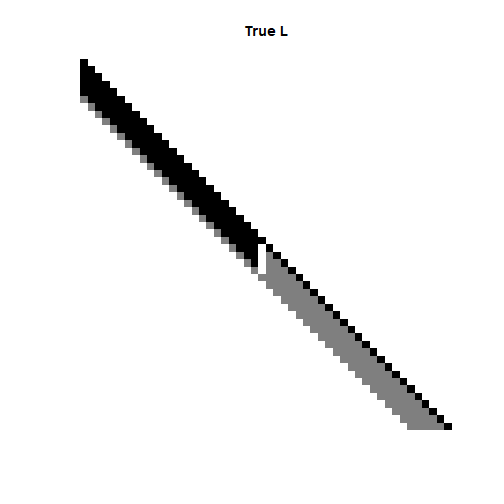

<a id="top"></a>

# SC Vignette
### Aramayis Dallakyan

[Introduction](#intro)

<!-- [Installation](#install) -->


[Quick Start](#qs)

[Using Cross Validation](#cv)

<a id="intro"></a>

## Introduction

The `SC` is a package that estimates a Cholesky factor of inverse covariance matrix via penalized maximum likelihood under local stationary assumption. In particular, given a data matrix $X \in \mathbb{R}^{n \times p}$, with each row an observation of a $p$ dimensional random vector $X \sim N(0, \Omega^{-1} = (L^T L)^{-1})$, this package implements a penalized likelihood-based approach of estimating $L$ by smoothing its subdiagonals.
This document serves as an introduction of using the package.

The main function is `smoothchol`, which takes a sample covariance matrix of the observations and returns the estimate of $L$. 

<a id="qs"></a>

## Quick Start


```r
library(SC)
```

## Usage
The package contains function `generateL` for generating true standard and modified Cholesky factor $L$. The  It takes as an input number of variables and number of bands and returns the Cholesky Factor. The type function 


```r
set.seed(12)
p <- 50
band <- 5
L_true <- generateL(p = p, band = band,case = "c")$L
```

Having true Cholesky factor, we can then generate a data matrix $X \in \mathbb{R}^{n \times p}$ with each row a random sample drawn independently from a Gaussian distribution of mean zero and covariance $\Sigma = (L^T L)^{-1}$. We use function `sample_gen` from the package `varband` to generate the data. After centering the dat, the sample covariance is esitmated by $S = \frac{X^tX}{n}$


```r
library(varband)
n = 100
# random sample
X <- sample_gen(L = L_true, n = n)
# sample covariance matrix
S <- crossprod(scale(X, center = TRUE, scale = FALSE)) / n
```

## Estimating L with a fixed tuning parameter

The `sc`function takes the following parameters:
- `S` - sample covariance matrix
- `lambda1` - controls the sparsity level
- `lambda_2` - controls the smoothness
- `max_iter` - Number of iteration for block coordinate algorithm
- `init.x`   - Initial vectorized Cholesky vactor $L$. If `NULL`, the default is $vec(\sqrt{diag(S)})$.
- `type` - type of the smoothing penalty
- `band` - if specified, algorithm forces the rest of entries zero and iterates only over specifed subdiagonals.
- `ABSTOL` - Tolerance for algorithm convergence.


```r
L_fused = smoothchol(S, lambda1 = 0, lambda2 = 0.5, band = band + 1, type = "fused")
```

```
## SC fails to converge, current value is 0.00305587
```
We can plot the true model and the estimated matrix by using `matimage` function from the package `varband`. 


```r
  matimage(L_true, main = "True L")
```



```r
  matimage(L_fused$L, main = "Smoothed Cholesky")
```


<a id="cv"></a>

## Using Cross Validation

In this section we use `smoothcholCV` to select the tuning parameter for the proposed method using cross validation and plot the true and esitmated first subdiagonals.


```r
L_fused_cv = smoothcholCV(k = 5, X, lambda2_seq = NULL, band = band,n_lambda = 40, pen.type = "fused" )
```

```
## SC fails to converge, current value is 0.00126301
```

```r
L_trend_cv = smoothcholCV(k = 5, X, lambda2_seq = NULL, band = band,n_lambda = 40, pen.type = "l1trend" )
```

```
## SC fails to converge, current value is 0.00104278
## SC fails to converge, current value is 0.00100774
## SC fails to converge, current value is 0.00103356
## SC fails to converge, current value is 0.00100254
## SC fails to converge, current value is 0.00104647
```

```r
L_hp_cv = smoothcholCV(k = 5, X, lambda2_seq = NULL, band = band,n_lambda = 40, pen.type = "HP" )
```

```
## SC fails to converge, current value is 0.00120893
## SC fails to converge, current value is 0.00140149
## SC fails to converge, current value is 0.00129277
## SC fails to converge, current value is 0.00131759
## SC fails to converge, current value is 0.00136113
## SC fails to converge, current value is 0.0012637
```

```r
## Extracting first subdiagonal
true_first = diag(L_true[-1, -p])
fused_first = diag(L_fused_cv$L_fit[-1, -p])
trend_first = diag(L_trend_cv$L_fit[-1, -p])
hp_first = diag(L_hp_cv$L_fit[-1, -p])
```

Now, to evaluate performance of our method we plot the true first subdiagonal and the estimated subdiagonal for all three estimators.


